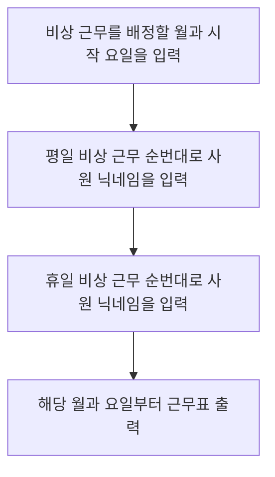

# 🚀 미션 - 개발자 비상근무 (이상준)

---

## 📃 개발자 비상근무 플로우 차트

---

## 🛠 구현 기능 목록
### 기능
- [x] 해당 월과 요일을 입력 받아서 평일 혹은 주말 근무자를 구하는 기능
- [ ] 근무자가 연속하여 근무할시 다음 순번의 근무자와 바꾸는 기능

### 입력
- [x] 비상근무 월과 시작 요일 입력
  - **예외사항**
  - [x] 1 - 12월이 아닌 다른 월을 입력한 경우
  - [x] 월, 화, 수, 목, 금, 토, 일 이 아닌 다른 값을 입력한 경우

- [x] 평일 비상 근무 순번대로 사원 닉네임을 입력
- [x] 휴일 비상 근무 순번대로 사원 닉네임을 입력

**공통예외사항**
- [x] 중복되어 사원 닉네임이 들어간 경우
- [x] 사원의 닉네임이 1~5자가 아닌 경우
- [x] 최소 5명, 최대 35명의 근무자가 아닌 경우

- [x] 평일, 휴일의 닉네임이 다른 경우

### 출력
- [x] 1일부터 해당 월에 맞는 마지막 날까지 근무자를 출력